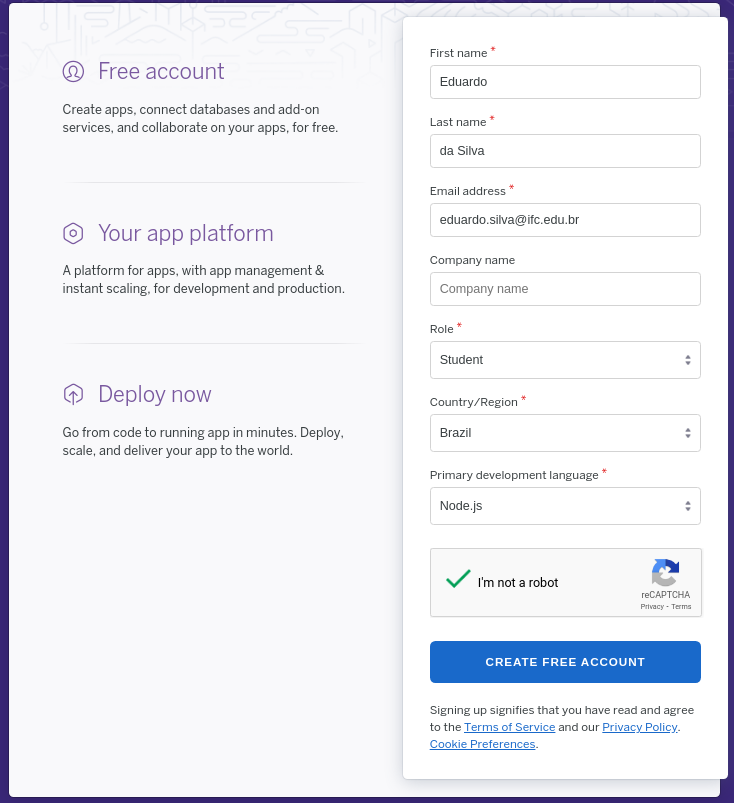

# Deploy no Heroku

## Preparação do projeto para o Heroku

Crie um arquivo com o nome de `Procfile` na base base do projeto. O arquivo deve ter o seguinte conteúdo:

```bash
web: npm start/
```

## Armazenamento do projeto no GitHub

O seu projeto deve ser armazenado como um novo repositório no GitHub. Para isso, não esqueça de incluir o diretório `node_modules` na lista de arquivos/diretórios ignorados para o repositório. Para isso, crie um arquivo chamado `.gitignore` com a seguinte informação:

```gitignore
node_modules/
```

Em seguida, pode subir/sincronizar o projeto com o GitHub

## Criação de um conta no Heroku

Caso você ainda não tenha uma conta no Heroku, seguir os seguintes passos:

* Acessar o [https://www.heroku.com/](https://www.heroku.com/)
* Clicar no ícone `SignUp` para criar uma nova conta


* Preencha o formulário de criação de conta



* Um e-mail de confirmação será enviado para o email que você informou no cadastro. Confirme o recebimento.
* Ao confirmar a criação da conta, será apresentado um formulário para a inserção da senha


* Após a criação senha de acesso, será apresentada uma tela de aceitação dos termos de contrato. Com a aceitação, você será redirecionado para o dashboard de gerenciamento.

## Criação de uma nova aplicação no Heroku

Caso você já tenha uma conta de acesso ao Heroku, acesse o endereço https://heroku.com e click na opção `Log in` . Em seguida, informe o usuário e senha criados.

Estando no dashboard de acesso, você deve criar uma nova aplicação, clicando em `Create new app`, como segue:


