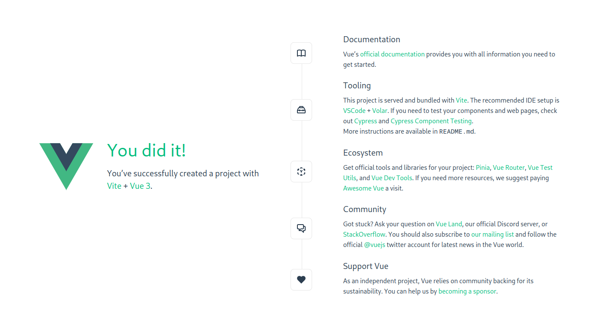
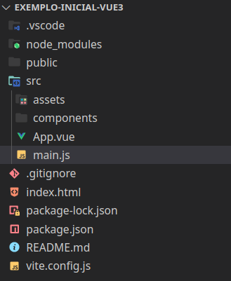

### Introdução

Criar um primeiro projeto usando o VueJS.

### Preparação

* Garantir que os passos da [Aula 0](../ambiente) foram executados.
* Crie uma nova pasta para o seu projeto e abra no VSCode.
* Abra a **pasta** do projeto no vscode (repita em voz alta: _"Nunca abra um arquivo, sempre abra a pasta."_).


# Criação de uma aplicação VueJS

Supondo que você esteja em um projeto vazio no VSCode. Para criar uma aplicação VueJS, abra o terminal e execute o comando:

```bash
npm init vue@latest .
```

*Note que usamos a opção `.` para criar a aplicação na pasta atual. Caso você não queira criar a aplicação na pasta atual, basta informar o nome da pasta que deseja criar.*

O comando anterior irá criar uma aplicação VueJS usando uma ferramenta de scaffolding chamada `create-vue`. Ele apresentará uma série de perguntas para você. Responda conforme a seguir (assumo que o nome da pasta e do projeto são iguais: `exemplo-inicial-vue3`):

```bash
✔ Project name: … exemplo-inicial-vue3
✔ Add TypeScript? … No
✔ Add JSX Support? … No
✔ Add Vue Router for Single Page Application development? … No
✔ Add Pinia for state management? … No
✔ Add Vitest for Unit testing? … No
✔ Add Cypress for both Unit and End-to-End testing? … No
✔ Add ESLint for code quality? … Yes
✔ Add Prettier for code formatting? … Yes

Scaffolding project in ./<your-project-name>...
Done.
```

Note que no exemplo anterior, escolhemos não usar o Vue Router, Pinia, Vitest, Cypress, ESLint e Prettier, bem como o suporte ao TypeScript e JSX. Você pode escolher o que desejar.

Em seguida, basta executar os seguintes comandos:

```bash
npm install
npm run dev
```

O primeiro comando instala as dependências do projeto. O segundo comando executa o servidor de desenvolvimento do VueJS. Em geral, o servidor estará em execução na porta 5173, caso esta esteja livre. Para acessar a aplicação, basta abrir o navegador e acessar a URL `http://localhost:5173`.

```bash
  VITE v3.2.2  ready in 500 ms

  ➜  Local:   http://127.0.0.1:5173/
  ➜  Network: use --host to expose
```

A imagem mostra a tela inicial da aplicação VueJS.



## Estrutura de arquivos

A imagem a seguir mostra a estrutura de arquivos inicial do projeto.



Esta estrutura pode ser resumida da seguinte forma:
* `node_modules`: pasta com as dependências do projeto.
* `public`: pasta com os arquivos estáticos da aplicação.
* `src`: pasta com os arquivos fonte da aplicação. Por padrão, o arquivo `App.vue` é o componente raiz da aplicação, enquanto o arquivo `main.js` é o ponto de entrada da aplicação. Em geral, esta é a pasta que você irá trabalhar.
* `index.html`: arquivo raiz do projeto que define .
* `package.json`: arquivo com as configurações do projeto.
* `package-lock.json`: arquivo com as configurações de versões das dependências do projeto.
* `README.md`: arquivo com as instruções de instalação e execução do projeto.
* `vite.config.js`: arquivo com as configurações do servidor de desenvolvimento.

### O arquivo index.html

O arquivo `index.html` é o arquivo raiz da aplicação. Ele define o elemento raiz da aplicação, que é o elemento `<div id="app">`. Este elemento é o elemento que será substituído pelo VueJS. O arquivo `index.html` também define o arquivo `main.js` como o ponto de entrada da aplicação.

O código a seguir mostra o arquivo `index.html`:

```html
<!DOCTYPE html>
<html lang="en">
  <head>
    <meta charset="UTF-8">
    <link rel="icon" href="/favicon.ico">
    <meta name="viewport" content="width=device-width, initial-scale=1.0">
    <title>Vite App</title>
  </head>
  <body>
    <div id="app"></div>
    <script type="module" src="/src/main.js"></script>
  </body>
</html>
```

Em geral, você não precisará alterar este arquivo. Contudo, alguns ajustes podem ser realizados. Por exemplo, você pode alterar o título da página, conforme o código a seguir:
```html
    <title>Aplicação exemplo Vue3</title>
```

Também, podem ser adicionados outras referências, como por exemplo, para um pacote de arquivos CSS.

Note também que antes de fechar a tag `</body>`, há uma referência para o arquivo `main.js`. Este arquivo é o ponto de entrada da aplicação. 

## O arquivo main.js

Como comentando anteriormente, o arquivo `main.js` é o ponto de entrada da aplicação. Ele é responsável por carregar o VueJS e o componente raiz da aplicação. O código a seguir mostra o arquivo `main.js`:

```javascript
import { createApp } from 'vue'
import App from './App.vue'

import './assets/main.css'

createApp(App).mount('#app')
```

Neste exemplo, o arquivo `main.js` importa o método `createApp` do pacote `vue`, responsável por criar a aplicação VueJS. Em seguida, o arquivo importa o componente raiz da aplicação, que é o arquivo `App.vue`. E, por fim, o arquivo importa o arquivo `main.css`, que é o arquivo de estilo da aplicação.

Na última linha, o arquivo chama o método `createApp` passando o componente raiz da aplicação como parâmetro. O método `createApp` retorna um objeto que possui o método `mount`, responsável por montar a aplicação no elemento raiz da aplicação, que é o elemento `<div id="app">`. A div com o id `app` é definida no arquivo `index.html`.

Ao longo das atividades, você irá alterar este arquivo para adicionar novos componentes e novas funcionalidades.

## O arquivo App.vue

O arquivo `App.vue` é o componente raiz da aplicação. Ele é responsável por carregar os demais componentes da aplicação. O código a seguir mostra a conteúdo padrão, que vem com a instalação, do arquivo `App.vue`:

```html
<script setup>
import HelloWorld from './components/HelloWorld.vue'
import TheWelcome from './components/TheWelcome.vue'
</script>

<template>
  <header>
    

    <div class="wrapper">
      <HelloWorld msg="You did it!" />
    </div>
  </header>

  <main>
    <TheWelcome />
  </main>
</template>

<style scoped>
header {
  line-height: 1.5;
}

.logo {
  display: block;
  margin: 0 auto 2rem;
}

@media (min-width: 1024px) {
  header {
    display: flex;
    place-items: center;
    padding-right: calc(var(--section-gap) / 2);
  }

  .logo {
    margin: 0 2rem 0 0;
  }

  header .wrapper {
    display: flex;
    place-items: flex-start;
    flex-wrap: wrap;
  }
}
</style>
```

Neste momento, você não precisa entender o código deste arquivo. Contudo, é importante que você saiba que este é o componente raiz da aplicação. Inicialmente, ele carrega dois componentes: `HelloWorld` e `TheWelcome`. Estes componentes são definidos nos arquivos `HelloWorld.vue` e `TheWelcome.vue`, respectivamente, ambos na pasta `./src/components`.

Não nos deteremos neste arquivo, pois ele será alterado ao longo das atividades.

<span style="display: flex; justify-content: space-between;"><span>[&lt; Introdução](/intro.html "Voltar")</span> <span>[Os componentes de arquivo único &gt;](/single-file-components.html "Próximo")</span></span>