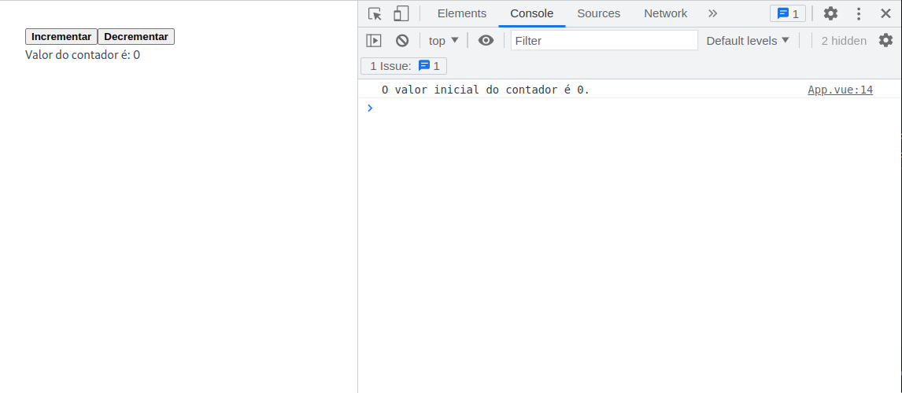

# Componentes de arquivo único (Sigle-file Components)

Os componentes de arquivo único (Sigle-file Components) são uma forma de definir componentes no VueJs. São componentes que são definidos em um único arquivo (arquivos `.vue`), encapsulando os components lógicos (JavaScript), de template (HTML) e de estilos (CSS).

O arquivo `App.vue`, apresentado anteriormente, é um exemplo de componente de arquivo único. Nesta etapa, faremos uma nova versão do arquivo `App.vue` e explicando cada parte do arquivo. O que desejamos fazer é uma página simples com dois botões: um responsável por incrementar uma unidade um valor e outro por decrementar uma unidade neste mesmo valor.

Como explicado anteriormente, um componente VueJS tem três partes: lógica, template e estilos. A estrutura de um componente de arquivo único é a seguinte:

```html
<script>
    // Lógica do componente
</script>

<template>
    <!-- Template do componente baseado em HTML -->
</template>

<style>
    /* Estilos do componente baseado em CSS */
</style>
```

A parte lógica do componentes, escrita em JavaScript ou TypeScript pode ser desenvolvida usando API de opções ou API de composição. Estudaremos essas duas formas na próxima etapa.

Na parte de template o Vue usa uma sintaxe baseada em HTML, que permite a utilização de diretivas e expressões. As diretivas são instruções especiais que são adicionadas ao template para alterar o comportamento da renderização. As expressões são trechos de código que são avaliados e renderizados como texto.

O exemplo abaixo mostra um componente de arquivo único, sem a lógica (que será apresentada a seguir), um template e um estilo:

```html
<script>
    // Será apresentado a seguir
</script>

<template>
  <button @click="incrementarContador">Incrementar</button>
  <button @click="decrementarContador">Decrementar</button>
  <p>Valor do contador é: {{ contador }}</p>
</template>

<style scoped>
button {
  font-weight: bold;
}
</style>

```

No bloco de estilos, o atributo `scoped` indica que os estilos definidos neste bloco são aplicados apenas ao componente. Isso significa que os estilos definidos neste bloco não afetam outros componentes. Foi definido um estilo para o elemento `button` que indica que a fonte será apresentada em negrito.

No bloco de template, foram definidos dois botões e um parágrafo. O primeiro botão tem um evento `click` associado a uma função chamada `incrementarContador`. O segundo botão tem um evento `click` associado a uma função chamada `decrementarContador`. O parágrafo apresenta o valor de uma variável chamada `contador`.

Ao longo do curso, vamos estudar os detalhes que podem ser utilizados usando a sintaxe de templates do Vue.

## Estilos de escrita de um componente de arquivo único

Quanto à parte lógica, existem duas formas de serem  escritas: usando API de opções (Options API) ou usando API de composição (Composition API). A API de opções é a forma original de escrever um componente de arquivo único, presente desde a primeira versão do VueJS. A API de composição é uma forma mais recente de escrever um componente de arquivo único, e será a que daremos preferência neste tutorial.

Implementaremos a parte lógica do exemplo que estamos desenvolvendo usando as duas formas. Em ambos os casos o resultado será o mesmo. Além disso, as diferenças aparecem apenas na parte lógica, sendo que a parte de template e de estilos são idênticas.

### Usando API de opções

Com API de opções, o componente é definido usando a propriedade `options` do objeto `Vue`. A propriedade `options` é um objeto que contém as propriedades `data`, `methods`, `computed`, `watch`, `components`, `directives`, `filters`, `mixins`, `extends`, `provide` e `inject`. Cada uma dessas propriedades é responsável por definir um tipo de dado ou comportamento do componente.

O código abaixo mostra um exemplo de componente de arquivo único usando API de opções:

```html
<script>
export default {
  data() {
    return {
      contador: 0
    }
  },
  methods: {
    incrementarContador() {
      this.contador++
    },
    decrementarContador() {
      this.contador--
    }
  },
  mounted() {
    console.log(`O valor inicial do contador é ${this.contador}.`)
  }
}
</script>

<template>
    <!-- Template já apresentada -->
</template>

<style scoped>
    /* Estilos já apresentados */
</style>
```

Neste exemplo, note que é exportado um objeto com várias propriedades. A propriedade `data` é responsável por definir uma variável chamada `contador` que é inicializada com o valor `0`. Nesse caso, a sintaxe exige que `data` seja uma função que retorna um objeto. As propriedades desse objeto de retorno são reconhecidas pelo VueJs como _variáveis_. 

A propriedade `methods` é responsável por definir duas funções: `incrementarContador` e `decrementarContador`. A função `incrementarContador` incrementa em uma unidade o valor da variável `contador`. A função `decrementarContador` decrementa em uma unidade o valor da variável `contador`. Note que no bloco de template, os eventos `click` dos botões estão associados a essas funções. 

A propriedade `mounted` é responsável por definir uma função que será executada quando o componente for montado. Neste caso, a função imprime no console o valor inicial da variável `contador`.

    Importante 
    
    Para visualizar os resultados no console, é necessário abrir o console do navegador (F12 no Chrome).

### Usando API de composição

Com API de composição, a lógica do componente é definida usando funções, chamadas de funções de composição. As funções de composição podem ser importadas de bibliotecas externas ou podem ser definidas pelo próprio desenvolvedor.

A API de composição é usada tipicamente com `<script setup>`. O atributo `setup` é uma propriedade especial que faz o Vue realizar transformações em tempo de compilação que permitem usar a API de composição com menos _boilerplate_ (repetição de códigos). Por exemplo, importações e variáveis ou funções declaradas no bloco de `<script setup>` podem ser usadas diretamente no bloco de template, sem configurações adicionais.

Abaixo, temos um exemplo de componente de arquivo único usando API de composição:

```html
<script setup>
import { ref, onMounted } from 'vue'

const contador = ref(0)

function incrementarContador() {
  contador.value++
}
function decrementarContador() {
  contador.value--
}

onMounted(() => {
  console.log(`O valor inicial do contador é ${contador.value}.`)
})
</script>


<template>
    <!-- Template já apresentada -->
</template>

<style scoped>
    /* Estilos já apresentados */
</style>
```

Neste exemplo, note que é importada a função `ref` da biblioteca `vue`. A função `ref` é responsável por criar uma variável reativa (estudaremos esse conceito em breve). A variável `contador` é inicializada com o valor `0`.

As funções `incrementarContador` e `decrementarContador` são responsáveis por incrementar e decrementar, respectivamente, em uma unidade o valor da variável `contador`. Note que no bloco de template, os eventos `click` dos botões estão associados a essas funções.

Por fim, a função `onMounted` é responsável por definir uma função que será executada quando o componente for montado. Neste caso, a função imprime no console o valor inicial da variável `contador`.


### Considerações importantes

Ambos os exemplos apresentados acima são equivalentes. A diferença entre eles é que o primeiro usa API de opções e o segundo usa API de composição. Também os dois estilos de escrita da parte lógica podem ser usados em um mesmo projeto. Na prática, a API de opção são construídas sobre a API de composição.

A API de opções é centrada no conceito de uma instância de componente, que em geral é mais adaptável aos desenvolvedores que preferem o modelo baseado em classes, oriundo da Orientação a Objetos. 

A API de composição é centrada no conceito de funções, que em geral é mais adaptável aos desenvolvedores que preferem o modelo baseado em funções, oriundo da Programação Funcional. 

Mas lembre, você não precisa usar uma API ou outra. Você pode usar as duas APIs em um mesmo projeto, dependendo da situação e complexidade do componente.

A figura abaixo mostra o resultado da aplicação exemplo apresentada acima. Note que o valor inicial do contador é impresso no console.




<span style="display: flex; justify-content: space-between;"><span>[&lt; Instalação e criação de um aplicação](criar-aplicacao-vuejs.html "Voltar")</span> <span>[Sumário &gt;](../ "Próximo")</span></span>