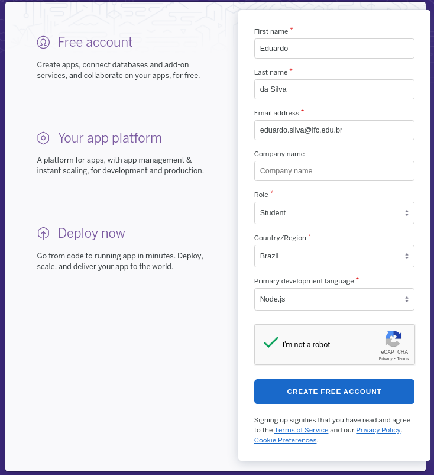

# Deploy no Heroku

## Preparação do projeto para o Heroku

Crie um arquivo com o nome de `Procfile` na base base do projeto. O arquivo deve ter o seguinte conteúdo:

```bash
web: npm start/
```

## Armazenamento do projeto no GitHub

O seu projeto deve ser armazenado como um novo repositório no GitHub. Para isso, não esqueça de incluir o diretório `node_modules` na lista de arquivos/diretórios ignorados para o repositório. Para isso, crie um arquivo chamado `.gitignore` com a seguinte informação:

```gitignore
node_modules/
```

Em seguida, pode subir/sincronizar o projeto com o GitHub

## Criação de um conta no Heroku

Caso você ainda não tenha uma conta no Heroku, seguir os seguintes passos:

* Acessar o [https://www.heroku.com/](https://www.heroku.com/)
* Clicar no ícone `SignUp` para criar uma nova conta


* Preencha o formulário de criação de conta



* Um e-mail de confirmação será enviado para o email que você informou no cadastro. Confirme o recebimento.
* Ao confirmar a criação da conta, será apresentado um formulário para a inserção da senha


* Após a criação senha de acesso, será apresentada uma tela de aceitação dos termos de contrato. Com a aceitação, você será redirecionado para o dashboard de gerenciamento.

## Criação de uma nova aplicação no Heroku

Caso você já tenha uma conta de acesso ao Heroku, acesse o endereço https://heroku.com e click na opção `Log in` . Em seguida, informe o usuário e senha criados.

Estando no *dashboard* de acesso, você deve criar uma nova aplicação, clicando em `Create new app`, como segue:


Em seguida, basta escolher um nome para o aplicativo. É importante ressaltar que esse nome deve ser único. Então, certifique-se que a mensagem `is available` apareceu logo abaixo no nome escolhido.


Com isso, a aplicação está criada e os recursos necessários serão alocados na plataforma do Heroku.

# Deploy da aplicação integrado com o GitHub

Após a criação da aplicação, você será redirecionado para uma tela de configuração do *deploy*. Caso você tenha saído do Heroku, você pode obter uma lista dos aplicativos na tela de *dashboard* após o *login*. Então, basta clicar sobre o aplicativo desejado e ter acesso às mesmas configurações.

A imagem a seguir mostra a tela de configuração do *deploy*. No que logo após a etapa 2 é necessário autorizar o acesso à conta do GitHub.


Depois de conectada a aplicação com o repositório no GitHub, basta escolher a *branch* para monitoramento e fazer o *deploy*.


Se tudo correr bem, você terá uma imagem similar à apresentada na figura abaixo.


Note que, como o repositório no GitHub está integrado com a aplicação, sempre que for realizado um *push* para a *branch* escolhida, a aplicação no Heroku será atualizada.

O endereço de acesso da aplicação será, no caso desse exemplo, https://times-jogadores.herokuapp.com/, sendo que `times-jogadores` será substituído pela nome da aplicação escolhido na criação. 

# Configuração da aplicação

Agora que a aplicação está criada e configurada, você pode alterar todos os acessos que foram feito realizados para `http://localhost:3000` para esse novo endereço no Heroku.

Dessa forma, você pode pesquisar todas as consultas da sua aplicação que foram realizadas usando o `axios` e ajustar para o novo endereço e então realizar os testes.

