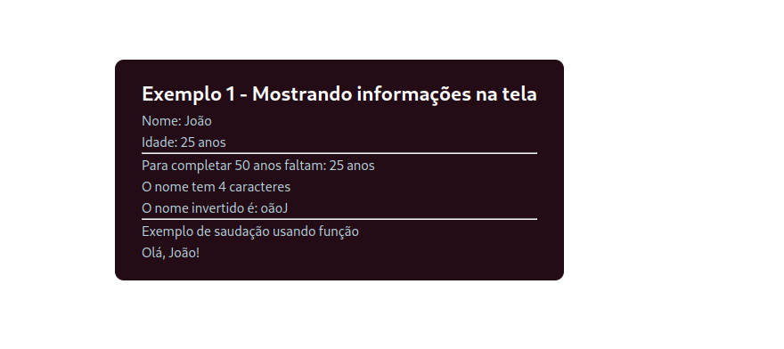

# Exemplos práticos

Nesta seção, vamos ver alguns exemplos práticos do uso de sintaxe de templates. Aqui, considero que você esteja iniciando um novo projeto VueJS para cada exemplo prático que estamos vendo. Ao longo do texto, eu apenas informo o que foi adicionado ou alterado ao projeto.

## Exemplo 1 - Mostrando informações    

Nesse exemplo, vamos mostrar informações na tela. Para isso, vamos editar o arquivo `App.vue` e adicionar o seguinte código:

```html
<script setup>
    const nome = 'João'
    const idade = 25

    function inverter(texto) {
        return texto.split('').reverse().join('')
    }

    function saudacao() {
        return `Olá, ${nome}!`
    }
</script>

<template>
    <div class="info">
        <h1>Exemplo 1 - Mostrando informações na tela</h1>
        <p>Nome: {{ nome }}</p>
        <p>Idade: {{ idade }} anos</p>
        <hr />
        <p>Para completar 50 anos faltam: {{ 50 - idade }} anos</p>
        <p>O nome tem {{ nome.length }} caracteres</p>
        <p>O nome invertido é: {{ inverter(nome) }}</p>
        <hr />
        <p> Exemplo de saudação usando função</p>
        <p> {{ saudacao() }} </p>
    </div>
</template>

<style scoped>
.info {
  background-color: rgba(35,12,22,1);
  padding: 20px 30px;
  color: rgb(183, 210, 219);
  border-radius: 10px;
}

h1 {
  color: white;
  font-weight: bold;
  font-size: 1.5em;
}
</style>
```

Este é um exemplo completo com vários exemplos de uso de sintaxe de templates. O nosso código está dividido em três partes: script, template e style. Vamos ver cada uma delas.

Primeiramente na parte de script:

*  `const nome = 'João'` - declaração de uma constante chamada `nome` com o valor `'João'`
*  `const idade = 25` - declaração de uma constante chamada `idade` com o valor `25`
*  `function inverter(texto) { ... }` - declaração de uma função chamada `inverter` que recebe um parâmetro chamado `texto`. Essa função inverte o texto recebido e retorna o texto invertido.
*  `function saudacao() { ... }` - declaração de uma função chamada `saudacao` que não recebe parâmetros. Essa função retorna uma saudação com o nome da pessoa.

No bloco de template, temos:

* `<div class="info">` - declaração de um elemento `div` com a classe `info`. Essa classe é utilizada no bloco de style.
* `<h1>Exemplo 1 - Mostrando informações na tela</h1>` - declaração de um elemento `h1` com o texto `Exemplo 1 - Mostrando informações na tela`. Essa *tag* também é personalizada no bloco de style.
* `<p>Nome: {{ nome }}</p>` - declaração de um elemento `p` com o texto `Nome: ` e o valor da variável `nome`. O valor da variável `nome` é mostrado entre chaves duplas `{{ }}`. Isso indica que o valor da variável `nome` será mostrado na tela.
* `<p>Idade: {{ idade }} anos</p>` - declaração de um elemento `p` com o texto `Idade: ` e o valor da variável `idade`. 
* `<hr />` - declaração de uma linha horizontal.
* `<p>Para completar 50 anos faltam: {{ 50 - idade }} anos</p>` - declaração de um elemento `p` com o texto `Para completar 50 anos faltam: ` e o valor da subtração entre 50 e a variável `idade`. Esse é um exemplo de uma expressão JavaScript realizando uma operação matemática.
* `<p>O nome tem {{ nome.length }} caracteres</p>` - declaração de um elemento `p` com o texto `O nome tem ` e o valor da propriedade `length` da variável `nome`. Esse é um exemplo de uma expressão JavaScript acessando uma propriedade de um objeto.
* `<p>O nome invertido é: {{ inverter(nome) }}</p>` - declaração de um elemento `p` com o texto `O nome invertido é: ` e o valor da função `inverter` passando a variável `nome` como parâmetro. Esse é um exemplo de uma expressão JavaScript chamando uma função definida no bloco de script.
* `<p> Exemplo de saudação usando função</p>` - declaração de um elemento `p` com o texto `Exemplo de saudação usando função`.
* `<p> {{ saudacao() }} </p>` - declaração de um elemento `p` com o valor da função `saudacao`. Essa função foi definida no bloco de script e não recebe parâmetros. 

Por fim, no bloco de style, temos:

* `.info { ... }` - declaração de uma classe chamada `info`. Essa classe é utilizada no bloco de template.
    * `background-color: rgba(35,12,22,1);` - declaração da cor de fundo do elemento com a classe `info`.
    * `padding: 20px 30px;` - declaração do espaçamento interno do elemento com a classe `info`.
    * `color: rgb(183, 210, 219);` - declaração da cor do texto do elemento com a classe `info`.
    * `border-radius: 10px;` - declaração do raio das bordas do elemento com a classe `info`.
* `h1 { ... }` - declaração de uma tag `h1`. Essa tag é personalizada no bloco de template.
    * `color: white;` - declaração da cor do texto do elemento `h1`.
    * `font-weight: bold;` - declaração do peso da fonte do elemento `h1`.
    * `font-size: 1.5em;` - declaração do tamanho da fonte do elemento `h1`.

Este é um exemplo completo de um componente Vue.js. Vamos ver como ele é mostrado na tela.




<span style="display: flex; justify-content: space-between;"><span>[&lt; Diretivas](diretivas.html "Início")</span> <span>[Exercícios &gt;](exercicios.html "Próximo")</span></span>